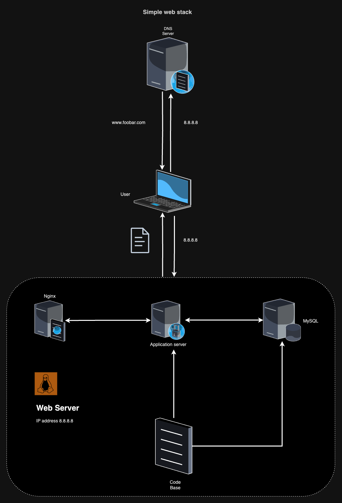

This web infrastructure is a basic setup hosting a website accessible through www.foobar.com. It lacks certain crucial features, and we'll delve into the specifics and issues.

### Components and Roles:

1. *Server:*
   - Definition: A computer hardware or software providing services to other computers (clients).
   - Role: Hosts the entire infrastructure and facilitates communication between components.

2. *Domain Name:*
   - Role: Provides a user-friendly alias for an IP address, making it easier to remember.
   - Example: www.foobar.com mapped to a specific IP address using an A record in DNS.

3. *DNS Record (www.foobar.com):*
   - Type: A Record (Address Mapping record), linking the hostname (www) to its corresponding IPv4 address.

4. *Web Server:*
   - Role: Software/hardware responding to HTTP or HTTPS requests, delivering requested content or error messages.

5. *Application Server:*
   - Role: Installs, operates, and hosts applications, facilitating the hosting and delivery of consumer/business applications.

6. *Database:*
   - Role: Maintains an organized collection of information, allowing easy access, management, and updates.

7. *Communication with Clients:*
   - Mechanism: Occurs over the internet network through the TCP/IP protocol suite.

### Issues:

1. *Single Points of Failure (SPOF):*
   - Example: If the MySQL database server is down, the entire website experiences downtime.
   - Implication: Lack of redundancy poses a significant risk to the website's availability.

2. *Downtime during Maintenance:*
   - Challenge: Maintenance checks require components or the entire server to be taken down.
   - Impact: Results in downtime, affecting user access to the website during maintenance activities.

3. *Scalability Challenges:*
   - Issue: Difficult to scale due to a single server containing all necessary components.
   - Consequence: Resource limitations or slowdowns during high traffic, hindering the ability to handle increased demand.

### Recommendations for Improvement:

1. *Redundancy:*
   - Implement redundant components to mitigate SPOF issues.
   - Example: Set up a backup database server to ensure continuous service if the primary server fails.

2. *Load Balancing:*
   - Introduce load balancing to distribute incoming traffic across multiple servers.
   - Benefit: Enhances scalability and prevents overload on a single server.

3. *Scheduled Maintenance:*
   - Plan maintenance during low-traffic periods to minimize the impact on users.
   - Use backup servers or temporary redirects during maintenance to maintain website availability.

4. *Scalability Measures:*
   - Explore options for horizontal scaling by adding more servers to distribute load.
   - Consider cloud services that provide scalable resources based on demand.

By addressing these issues and implementing recommended improvements, the web infrastructure can enhance its reliability, minimize downtime, and efficiently handle varying levels of user traffic.
