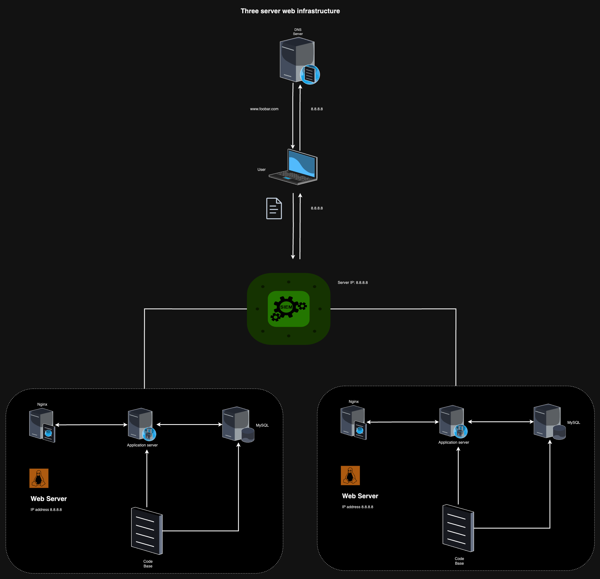

Description:

This distributed web infrastructure aims to reduce traffic to the primary server by distributing the load to a replica server, facilitated by a load balancer responsible for balancing the workload between the primary and replica servers.

1. *Load Balancer Distribution Algorithm:*
   - The HAProxy load balancer utilizes the Round Robin distribution algorithm. This algorithm evenly distributes requests among servers based on their weights, ensuring fair processing time. It is dynamic, allowing adjustments to server weights on the fly.

2. *Load Balancer Setup:*
   - The HAProxy load balancer implements an Active-Passive setup. In this configuration, not all nodes are active simultaneously. For instance, if the first node is active, the second node remains passive or on standby. The passive node becomes active if the preceding node becomes inactive.

3. *Database Primary-Replica (Master-Slave) Cluster:*
   - The Primary-Replica setup designates one server as the Primary (Master) and the other as the Replica (Slave). The Primary server handles read/write requests, while the Replica server is limited to read operations. Synchronization of data occurs whenever the Primary server executes a write operation.

4. *Difference Between Primary and Replica Nodes:*
   - The Primary node manages write operations for the site, while the Replica node handles read operations. This distribution helps alleviate read traffic to the Primary node, optimizing performance.

Issues with This Infrastructure:

1. *Single Points of Failure (SPOF):*
   - Multiple SPOFs exist in this infrastructure. For instance, if the Primary MySQL database server, the server with the load balancer, or the application server connecting to the primary database server goes down, the entire site may be affected.

2. *Security Concerns:*
   - The lack of SSL encryption for transmitted data poses a security risk, potentially allowing hackers to spy on the network. Additionally, the absence of a firewall on any server makes it challenging to block unauthorized IPs, posing a security vulnerability.

3. *Monitoring Absence:*
   - Without a monitoring system, there is no way to assess the status of each server. Monitoring is crucial for identifying potential issues, performance bottlenecks, or signs of impending failures.

To enhance the infrastructure, it is recommended to address SPOFs through redundancy, implement SSL certificates for encrypted communication, deploy firewalls for security, and establish a monitoring system for real-time server status evaluation.
