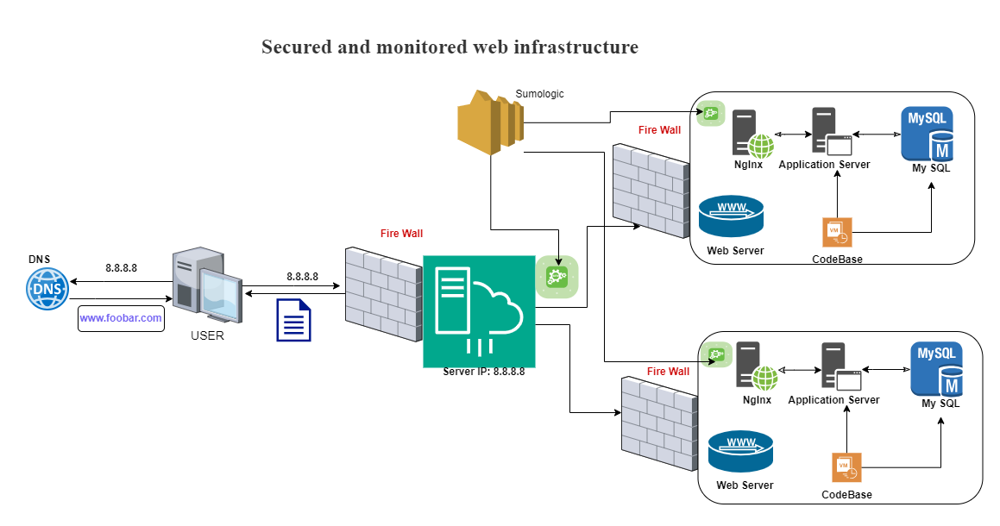

Description:

This web infrastructure consists of three servers designed to be secure, monitored, and capable of serving encrypted traffic.

1. *Firewalls:*
   - Firewalls serve the purpose of protecting the network, particularly the web servers, from unwanted and unauthorized users. They act as intermediaries between the internal and external networks, blocking incoming traffic that matches criteria indicative of unauthorized access. This helps enhance the security of the infrastructure.

2. *SSL Certificate:*
   - SSL certificates are implemented to encrypt traffic between the web servers and the external network. This encryption is vital in preventing man-in-the-middle attacks (MITM) and thwarting network sniffers attempting to intercept traffic. SSL certificates ensure privacy, data integrity, and identification by securing the communication channel between servers and external users.

3. *Monitoring Clients:*
   - Monitoring clients play a crucial role in overseeing the servers and external network. They analyze server performance, evaluate overall health, and promptly alert administrators to any deviations from expected operations. The monitoring tools observe key metrics, test server accessibility, measure response times, and detect errors such as corrupt or missing files, security vulnerabilities, and other issues. This proactive monitoring helps maintain optimal server performance.

Issues with This Infrastructure:

1. *SSL Termination at Load Balancer:*
   - Terminating SSL at the load balancer level might leave the traffic between the load balancer and the web servers unencrypted. To address this, SSL termination could be extended to the web servers themselves, ensuring end-to-end encryption for all traffic.

2. *Single MySQL Server:*
   - Having a single MySQL server poses scalability challenges and acts as a potential single point of failure for the web infrastructure. A more scalable and fault-tolerant approach would involve implementing a MySQL cluster or employing database replication to distribute the load and enhance reliability.

3. *Uniform Server Components:*
   - Utilizing servers with identical components may lead to resource contention, including CPU, memory, and I/O, potentially resulting in poor performance. Moreover, this uniform setup hinders scalability and makes it challenging to pinpoint the source of problems. Adopting a more modular and scalable architecture, where resources can be allocated dynamically based on demand, would mitigate these issues.

To improve the infrastructure, consider extending SSL encryption to the web servers, implement database clustering or replication for MySQL, and adopt a more flexible and scalable server architecture to optimize resource utilization and facilitate future growth.
